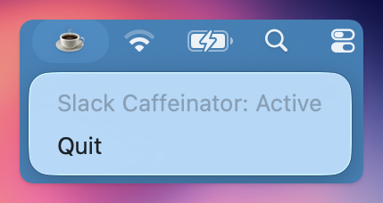

# Slack Caffeinator

Keep your Slack status 'Online' by gently wiggling the mouse when you are idle

Automatically launches when you login



## Requirements

You need the Python Homebrew installation

```sh
brew install Python
```

## Installation

```bash
./install.sh
```
